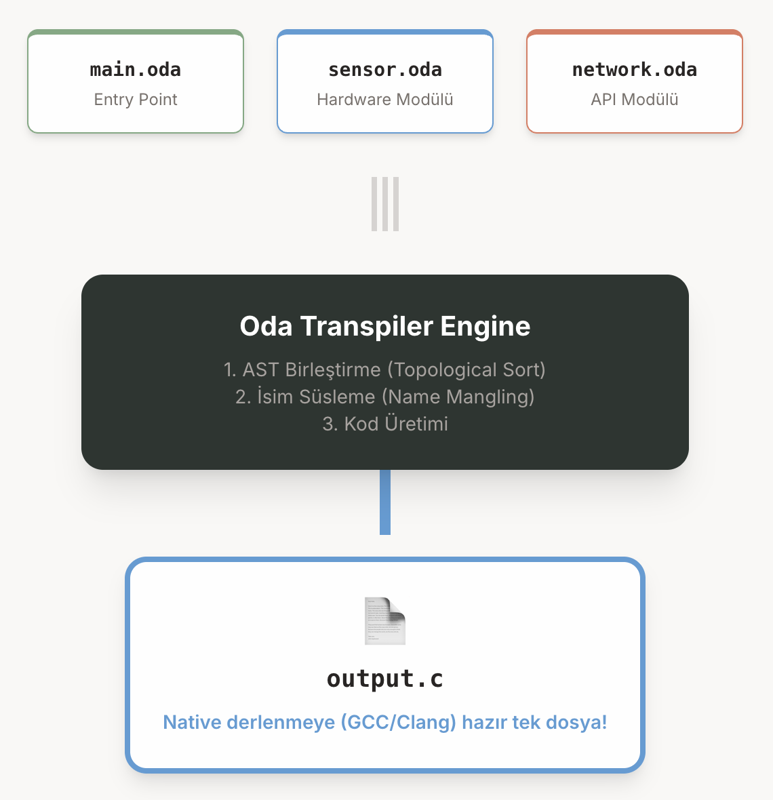

# OdaLanguage 🏠

> **"The safest room for code."**

OdaLanguage, modern, yarı-statik tipli, yüksek okunabilirliğe sahip bir programlama dilidir.
Özel bir transpiler aracılığıyla doğrudan optimize edilmiş **C koduna** derlenir.



## ✨ Özellikler

| Özellik | Açıklama |
|---|---|
| 🔄 **C'ye Transpilasyon** | `.oda` → AST → Unity Build C → Native Binary |
| 🛡️ **Null Safety** | Non-nullable by default, `?` ile nullable, `??` ile safe unwrap |
| 🔒 **Immutability** | `stay` ile değiştirilemez değişkenler |
| 🏗️ **RAII** | `destruct()` otomatik scope-end çağrısı |
| 🔄 **Döngü Esnekliği** | Artan/Azalan aralıklar, `step` adımı, `reversed` ve dizi iterasyonu |
| 📏 **Aralık Operatörleri** | `..` (exclusive) ve `..=` (inclusive) desteği |
| 🏗️ **OOP** | Class → C struct + name-mangled fonksiyonlar |
| 🔗 **ref Passing** | Güvenli pass-by-reference mekanizması |
| 🎯 **Widening-Only Coercion** | `int→float ✅` / `uint→int ❌` |
| 💬 **Yorum Desteği** | `//` tek satır ve `//* ... *//` çok satırlı yorumlar |
| 📝 **String Interpolation** | `"Hello {name}!"` |
| 🛑 **Strict Checking** | Semantik hatalar artık derlemeyi tamamen durdurur |
| 📦 **Diziler (Arrays)** | Statik (`int[3]`), Dinamik (`int[]`) ve N-Boyutlu (`int[][]`) diziler, `new` anahtar kelimesi ile bellek tahsisi |
| 📂 **Dosya G/Ç (I/O)** | `readFile()` ile dosya okuma ve `input()` ile kullanıcı girişi alma |

## 🚀 Hızlı Başlangıç

```bash
# Sadece C'ye dönüştür
./oda transpile examples/hello.oda

# Derle
./oda build examples/hello.oda

# Derle ve çalıştır
./oda run examples/hello.oda
```

## 📝 Örnek — hello.oda

```oda
// Oda Language Basics
int speed = 100
stay float gravity = 9.81

//*
Çok satırlı
blok yorum desteği
*//

string name = "OdaLang"
print("Hello from OdaLanguage!")

// Range-based for loops
for (int i in 0..10 step 2) {
    print(i) // 0 to 10 (exclusive), increase by 2
}

for (int i in 6..0 step 2) {
    print(i) // 6 to 0, decrease by 1
}

for (int i in 0..=5) {
    print(i) // 0 to 5 (inclusive), increase by 1
}

// Array iteration
int[] numbers = [10, 20, 30]
for (int n in numbers) {
    print(n)
}

// Null safety
string? alias = null
print(alias ?? "No Alias")
```

## 📝 Örnek — engine.oda (Class & RAII)

```
class Engine {
    int _rpm
    string _port

    construct(string port) {
        _port = port
        _rpm = 0
        print("Connected to " + _port)
    }

    func rev_up() {
        _rpm = _rpm + 1000
    }

    destruct() {
        print("Closing port: " + _port)
    }
}

Engine v8 = Engine("COM3")
v8.rev_up()
// → destruct() otomatik çağrılır!
```

## 📝 Örnek — arrays_io.oda (Diziler ve I/O)

```oda
// Statik ve Dinamik Diziler
int[3] static_arr = [1, 2, 3]
int[] dynamic_arr = [4, 5, 6]

// Çok Boyutlu Diziler
int[][] matrix = [[1, 2], [3, 4], [5, 6]]
print("Matrix element: " + matrix[1][1]) // 4 yazdırır

// N-Boyutlu Dinamik Bellek Tahsisi (new)
int rows = 10
int cols = 10
int[][] dynamic_grid = new int[rows][cols]
dynamic_grid[0][1] = 42
print("Dinamik Dizi: " + dynamic_grid[0][1])

// (Kapsamlı N-Boyutlu dizi örneği için "examples/OdaLife/" klasörünü inceleyebilirsiniz)

// Dosya Okuma
string? content = readFile("examples/hello.oda")
if (content != null) {
    print("Dosya başarıyla okundu!")
}

// Kullanıcı Girişi (Input)
print("Adınızı giriniz:")
string user_name = input()
print("Merhaba, " + user_name + "!")
```

## 📂 Proje Yapısı

```
OdaLanguage/
├── oda/                    # Transpiler kaynak kodu
│   ├── tokens.py           # Token tanımları
│   ├── lexer.py            # Tokenizer
│   ├── parser.py           # Recursive descent parser
│   ├── ast_nodes.py        # AST düğüm sınıfları
│   ├── semantic.py         # Semantic analiz
│   ├── codegen.py          # C kod üretici
│   └── main.py             # CLI
├── examples/               # Örnek .oda programları
├── output/                 # Üretilen C çıktıları
└── OdaLanguage .pdf        # Dil spesifikasyonu
```

## 🛠️ Gereksinimler

- Python 3.10+
- GCC veya Clang (derleme ve çalıştırma için)

## 📄 Lisans

Bu proje aktif geliştirme aşamasındadır.
